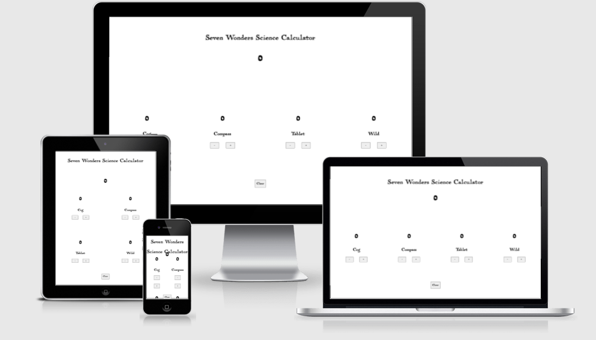
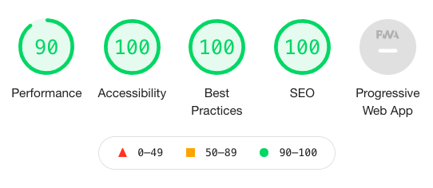
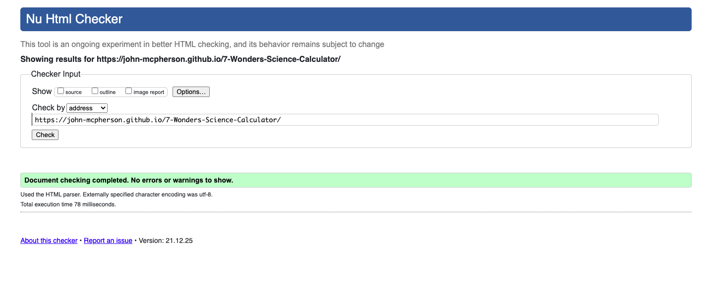
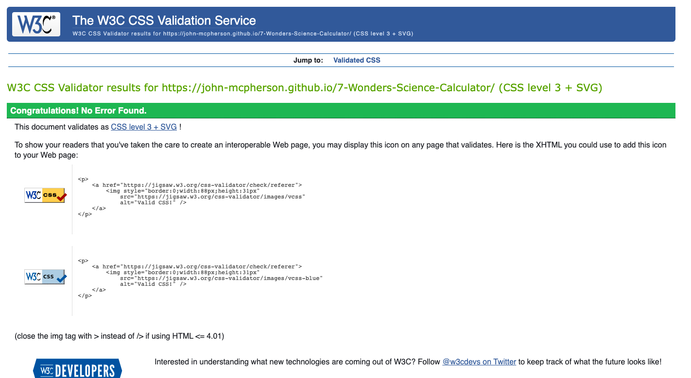
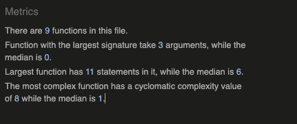

# **Seven Wonders Science Calculator**

A quick and simple project designed to speed up the process of working out each players science points in the popular boardgame 7 Wonders.

You can see the deployed site [here](https://john-mcpherson.github.io/7-Wonders-Science-Calculator/).

## **Contents**
* [Features](#features)
    * [Total Score](#total-score) 
    * [Wild Cards](#wild-cards) 
* [Testing](#testing)

## **Features**
### **Toal Score**
* The application should display the total score in an easy to read format. And it will be automatically calculated whenever the user updates an input.  

### **Wild Cards**
* The application should work out the best option when using wild cards. 

### **Clear Button**
* The application has the option to clear all user input with one button press. That way users can quickly. and easily check multiple players scores. 

## **Testing**
* [Preformance](#preformance)
* [Validation](#validation)
* [Manual Testing](#manual-testing)

### **Preformance**

I ran the website through the lighthouse checker and it came back with the following score;

### **Validation**

First I ran the website through the the w3 html checker and it came back with no issues;

Then I ran it through the W3 CSS checker and that also came back with no issues; 

And finally I ran it through the JSHint validatior and that also came back with no issues; 

### **Manual Testing**

